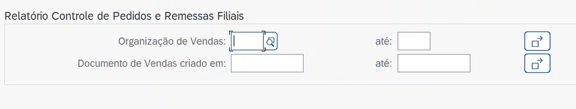

<h1 align="center"> abap_structured_alv_sd_report </h1>

## 📃 Descrição
Relatório ALV Estruturado, Módulo SD, desenvolvido para consultar Ordens de Venda e Remessas.

<a href=".readme/spec.md">Visualizar Especificação Funcional Completa</a>

## 📷 Preview

 

<a href="https://youtu.be/hZGbBWXTuTE">Vídeo de Demonstração do abap_structured_alv_sd_report</a>

## 📚 Funcionalidades
* Relatório SD (Ordens de Vendas e Remessas)
* Hotspot: Ao clicar nas colunas Ordem de Venda, Recebedor da Mercadoria e Remessa redireciona-se para as transações correspondentes para gerenciamento da entidade que a informação da coluna apresenta.

## 🚀 Rodando o projeto
<a href="https://github.com/argelcapela/abap_structured_alv_sd_report">Código Fonte no Github: abap_structured_alv_sd_report</a>

1) Acesse a transação SE38, crie um programa chamado abap_structured_alv_sd_report e copie o código fonte do programa.
2) Ainda na SE38, editando o programa criado anteriormente, acesse os elementos de texto do programa. Copie e cole os elementos de texto 1 e 2, nas seções de text elements e selection texts.
4) Depois que tudo for criado, ative o programa. Depois execute e seja feliz. 🙏😁

## 🧑‍💻 Tecnologias utilizadas

 
    

## 🧑‍🏫 Aprendizados
* Funcionamento de 9 Tabelas SD: vbak, vbpa, tvakt, tvaut, vbpa, kna1, vbfa, obknr, ser01.
* Fluxo de funcionamento do Hotspot com transações SD: va01, vl03 e BP.
* Funcionamento de uma seleção utilizando o [For All Entries]
* Estrutura e organização de código ABAP

## 🤝 Colaboradores
<table>
  <tr>
    <td align="center">
      <a href="http://github.com/argelcapela">
         
        
          <b>Argel Capela</b>
        
      </a>
    </td>
  </tr>
</table>

## 🎯 Status do projeto
* Concluído em versão 1.0

## 🦟 Erros/Feedback
Identificou algum erro ou tem alguma sugestão? Por favor me informe, fico feliz em seguir aprendendo mais e melhorando.
